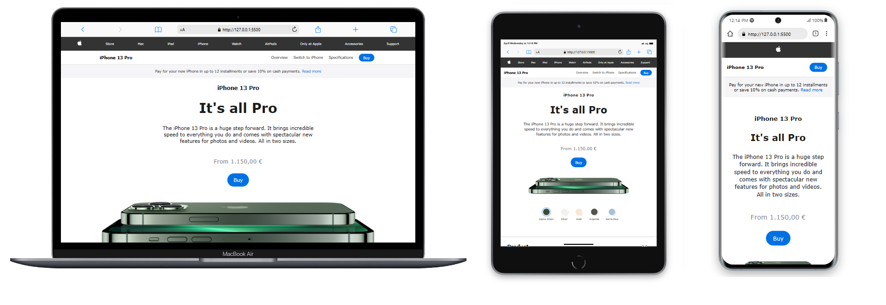

<h1 align="center">iPhone 13 Pro Page Clone</h1>

  <a href="#-project">Project</a>&nbsp;&nbsp;&nbsp;|&nbsp;&nbsp;&nbsp;
  <a href="#-technologies-used">Technologies</a>&nbsp;&nbsp;&nbsp;|&nbsp;&nbsp;&nbsp;
  <a href="#-preview">Preview</a>

  

## 💻 Project
This project is a clone of the Apple iPhone 13 Pro page, faithfully replicating the design and functionality of the original page. The goal of this project is to showcase web development skills in HTML, CSS, and JavaScript by creating an interactive replica of the iPhone 13 Pro page. The page includes elements such as navigation, product description, specifications, additional information, and a carousel of related products.

## ✨ Technologies used:
- HTML
- CSS
- JavaScript
- Font Awesome (for icons)

## ⚙️ Features
- Dynamic swapping of iPhone 13 Pro images based on the selected color
- Expansion and contraction of additional information sections upon clicking the corresponding buttons
- Navigation between different items in the recommended products carousel

## 🔗 Preview
<a href="https://isabelaolsemann.github.io/CloneiPhone13/" target="_blank">View iPhone 13 Pro Page Clone</a>

---
This project was developed by Isabela Olsemann.
